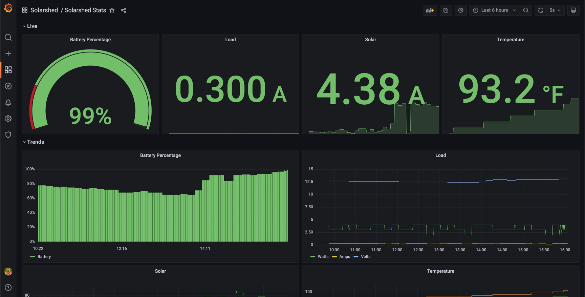

# Solarshed Containerized

## Features
* Runs on Raspberry Pi / RaspbianOS when compiled for ARM
* ~100mb container size
* Sample grafana dashboard (./grafana/sample_solar_dashboard.json)

### How to run 
```
docker run --name solarshed -d -p 5000:5000 \
--device /dev/ttyUSB0:/dev/ttyUSB0 --restart=always \
--priviledged ghcr.io/truncj/solarshed
```

### Solar Shed Setup

Inside | Outside
--- | ---
 | 


### Grafana Dashboard


